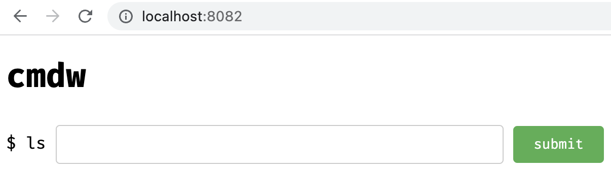
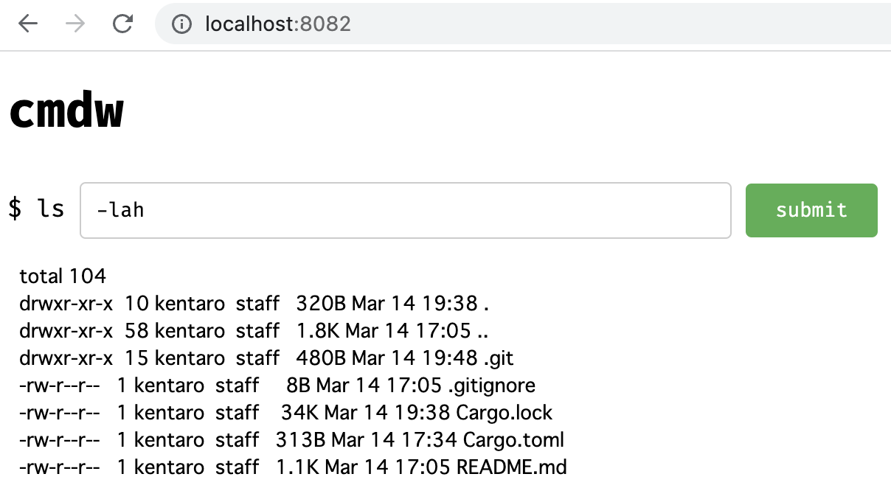

# cmdw

`cmdw` is a CLI tool to execute an arbitrary command and to reveal the result of the executed command via HTTP. It can be useful when you want someone to execute a command in your local environment.

## Usage

Install it by `cargo install` and execute:

```shell
cargo install --path .
cmdw --command ls --addr 127.0.0.1 --port 8082
```

Or execute it by `cargo run`:

```shell
cargo run -- --command ls --addr 127.0.0.1 --port 8082
```

You'll see such a Web UI below:



Arguments put into the form are passed to the command:




## Author

Kentaro Kuribayashi &lt;kentarok@gmail.com&gt;
